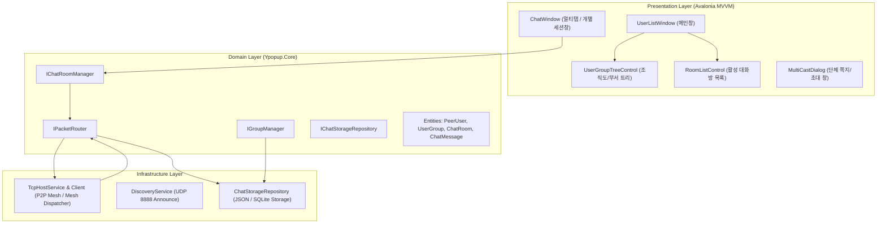

# Y-popup 멀티챗 & 그룹화 아키텍처 및 세부 설계 사양서

## 1. 개요 및 설계 철학

본 문서는 **Y-popup (파란전화기)** 메신저에 **멀티챗 (1:1 다중 대화 및 다자간 대화방)** 및 **사용자/대화방 그룹화 (조직도/부서 트리 및 채팅방 그룹)** 기능을 확장하기 위한 전체 기술 아키텍처 및 데이터 흐름을 정의합니다.

### 1.1 배경 및 목적
* 사내 및 중소규모 오피스 환경에서 기존 1회성 팝업(X-Popup 스타일)을 넘어, **부서/팀별 사용자 트리(접기/펼치기)**, **단체 공지/쪽지 일괄 발송**, **실시간 다자간 그룹 채팅 세션** 지원.
* **서버리스(Serverless) Pure LAN P2P 환경** 유지: 별도 중앙 서버 설치 없이 UDP 브로드캐스트와 P2P TCP Mesh 소켓 통신으로 동작.
* **하위 호환성(Backward Compatibility)**: 기존 Y-popup v2.x 클라이언트(단순 1:1 쪽지만 지원)와 혼용 환경에서도 패킷 오류나 크래시 없이 통신 가능.

---

## 2. 시스템 아키텍처 및 계층 다이어그램



---

## 3. 핵심 서브시스템 설계

### 3.1 P2P Full-Mesh 멀티챗 세션 라이프사이클
중앙 서버가 없는 LAN 환경에서 $N$명의 사용자가 참여하는 그룹 대화방을 구현하기 위해 **P2P Full-Mesh Dispatching** 방식을 적용합니다.

1. **대화방 개설 (Room Creation)**:
   * 방장(Creator)이 참여자 목록(ParticipantIds)을 선택하고 고유 `RoomId`(`Guid`)를 생성합니다.
   * `RoomJoin` 패킷을 모든 참여자에게 P2P TCP로 발송합니다.
2. **메시지 발송 (Multi-cast Broadcast)**:
   * 발신자가 메시지를 작성하면, 로컬 `ChatRoom.ParticipantIds`에 속한 모든 원격 피어의 `IpAddress:TcpPort`로 순차 또는 병렬 TCP 연결을 맺어 `LanPacket(Type=GroupChatMessage, RoomId=...)`을 전송합니다.
3. **메시지 수신 및 라우팅**:
   * 수신 측 `TcpHostService`는 `LanPacket`을 파싱하여 `IPacketRouter`에 전달합니다.
   * `IPacketRouter`는 `RoomId`를 확인하여:
     * 해당 룸의 UI 창이 열려있으면 즉시 뷰모델로 이벤트 전달 (`OnRoomMessageReceived`).
     * 룸 창이 닫혀있으면 로컬 DB에 저장 후 알림 팝업 및 트레이 배지 트리거, 신규 세션 목록에 표시.
4. **멤버 퇴장/초대**:
   * `RoomLeave`, `RoomInvite` 패킷을 전체 참여자에게 브로드캐스팅하여 각 노드의 `ParticipantIds`를 동기화합니다.

### 3.2 사용자 조직도 / 그룹 트리 아키텍처
* **자동 그룹화(Discovery 기반)**: 기존 피어의 UDP Announce에 포함된 `Group`(부서명) 필드를 파싱하여 1차 자동 분류.
* **사용자 정의 그룹화(Local Override)**:
  * 로컬 저장소(`groups.json`)에 `UserGroup` 엔티티를 관리하여 사용자가 커스텀 그룹(예: "즐겨찾기", "응급실 당직", "원무팀")을 생성하고 피어를 매핑 가능.
  * 그룹 순서(SortOrder), 접힘 상태(IsExpanded) 영속화.

### 3.3 로컬 영속성 계층 (Infrastructure.Storage)
* 무설치/경량 철학을 위해 `.NET 8` 기본 `System.Text.Json` 기반 파일 저장소(`%AppData%\Y-popup\chat_history\`)를 우선 지원하고, 추후 필요 시 SQLite/LiteDB 전환이 가능한 `IChatStorageRepository` 인터페이스로 추상화합니다.
* 디렉터리 구조:
  ```
  %AppData%/Y-popup/
  ├── settings.json
  ├── groups.json                     # 사용자 정의 그룹 및 매핑
  └── rooms/
      ├── {roomId}.json               # 룸 메타데이터 및 참가자
      └── messages_{roomId}.jsonl     # Append-only 대화 로그
  ```

---

## 4. 장애 대응 및 동시성 제어 (Edge Cases)

1. **오프라인/미수신 피어 처리**:
   * 발송 시 특정 참여자의 연결이 실패한 경우 발신자에게 전송 실패 피어 목록 표시("3명 중 1명 전송 실패: 홍길동(오프라인)").
   * 성공한 피어들에게는 정상 전송되어 세션 단절 방지.
2. **동시성 및 UI 스레드 격리**:
   * `PacketRouter`는 `ConcurrentDictionary<string, Action<LanPacket>>`를 사용하여 비동기 소켓 스레드와 UI 스레드 간 락 경합 방지.
   * UI 이벤트 디스패치는 Avalonia `Dispatcher.UIThread.Post()`를 통해 안전하게 마샬링.
3. **하위 호환성 (Legacy Fallback)**:
   * v2.1 이전 클라이언트는 알 수 없는 `PacketType.GroupChatMessage` 수신 시 `InvalidDataException` 또는 무시하도록 설계되어 있으므로, 구버전 피어에게는 일반 `TextMessage`로 포맷팅하여 fallback 전송하는 옵션 제공.
